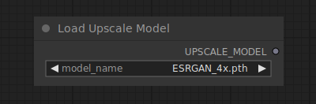

# Load Upscale Model

{ align=right width=450 }

The Load Upscale Model node can be used to load a specific upscale model, upscale models are used to upscale images.

## inputs

`model_name`

:   The name of the upscale model.

## outputs

`UPSCALE_MODEL`

:   The upscale model used for upscaling images.

## example

example usage text with workflow image