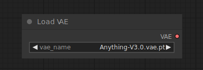

# Load VAE

{ align=right width=450 }

The Load VAE node can be used to load a specific VAE model, VAE models are used to encoding and decoding images to and from latent space. Although the [Load Checkpoint](LoadCheckpoint.md) node provides a VAE model alongside the diffusion model, sometimes it can be useful to use a specific VAE model.

## inputs

`vae_name`

:   The name of the VAE.

## outputs

`VAE`

:   The VAE model used for encoding and decoding images to and from latent space.

## example

At times you might wish to use a different VAE than the one that came loaded with the [Load Checkpoint](./LoadCheckpoint.md) node. In the example below we use a different VAE to encode an image to latent space, and decode the result of the Ksampler.

