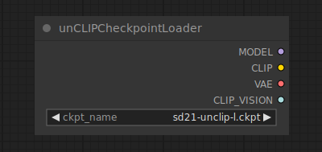

# unCLIP Checkpoint Loader

{ align=right width=450 }

The unCLIP Checkpoint Loader node can be used to load a diffusion model specifically made to work with unCLIP. unCLIP Diffusion models are used to denoise latents conditioned not only on the provided text prompt, but also on provided images. This node will also provide the appropriate VAE and CLIP amd CLIP vision models.

!!! warning
    even though this node can be used to load all diffusion models, not all diffusion models are compatible with unCLIP.

## inputs

`ckpt_name`

:   The name of the model.

## outputs

`MODEL`

:   The model used for denoising latents.

`CLIP`

:   The CLIP model used for encoding text prompts.

`VAE`

:   The VAE model used for encoding and decoding images to and from latent space.

`CLIP_VISION`

:   The CLIP Vision model used for encoding image prompts.

## example

example usage text with workflow image