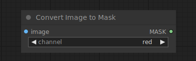

# Convert Image to Mask

{ align=right width=450 }

The Convert Image yo Mask node can be used to convert a specific channel of an image into a mask.

## inputs

`image`

:   The pixel image to be converted to a mask.

`channel`

:   Which channel to use as a mask.

## outputs

`MASK`

:   The mask created from the image channel.

## example

example usage text with workflow image