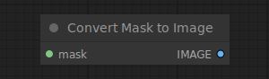

# Convert Mask to Image

{ align=right width=450 }

The Convert Mask to Image node can be used to convert a mask to a grey scale image.

## inputs

`mask`

:   The mask to be converted to an image.

## outputs

`IMAGE`

:   The grey scale image from the mask.

## example

example usage text with workflow image