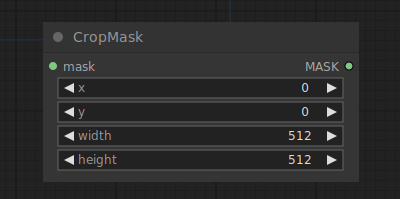

# Crop Mask

{ align=right width=450 }

The Crop Mask node can be used to crop a mask to a new shape.

!!! info
    The origin of the coordinate system in ComfyUI is at the top left corner.

## inputs

`mask`

:   The mask to be cropped.

`width`

:   The width of the area in pixels.

`height`

:   The height of the area in pixels.

`x`

:   The x coordinate of the area in pixels.

`y`

:   The y coordinate of the area in pixels.

## outputs

`MASK`

:   The cropped mask.

## example

example usage text with workflow image