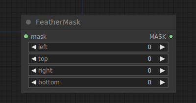

# Feather Mask

{ align=right width=450 }

The Feather Mask node can be used to feather a mask.

## inputs

`mask`

:   The mask to be feathered.

`left`

:   How much to feather edges on the left

`top`

:   How much to feather edges on the top

`right`

:   How much to feather edges on the right

`bottom`

:   How much to feather edges on the bottom

## outputs

`MASK`

:   The feathered mask.

## example

example usage text with workflow image