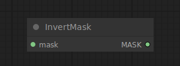

# Invert Mask

{ align=right width=450 }

The Invert Mask node can be used to invert a mask.

## inputs

`mask`

:   The mask to be inverted.

## outputs

`MASK`

:   The inverted mask.

## example

example usage text with workflow image