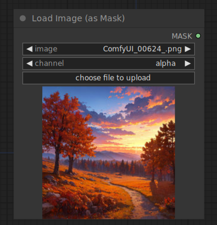

# Load Image (as Mask)

{ align=right width=450 }

The Load Image (as Mask) node can be used to load a channel of an image to use as a mask. Images can be uploaded by starting the file dialog or by dropping an image onto the node. Once the image has been uploaded they can be selected inside the node.

!!! info
    by default images will be uploaded to the input folder of ComfyUI

## inputs

`image`

:   The name of the image to be converted to a mask.

`channel`

:   The channel of the image to be used as mask.

## outputs

`MASK`

:   The mask created from the image channel.

## example

example usage text with workflow image