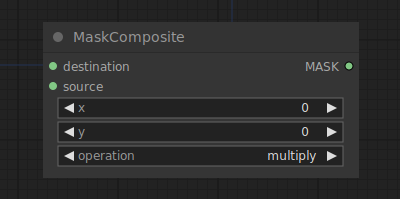

# Mask Composite

{ align=right width=450 }

The Mask Composite node can be used to paste one mask into another.

!!! info
    The origin of the coordinate system in ComfyUI is at the top left corner.

## inputs

`destination`

:   The mask that is to be pasted in.

`source`

:   The mask that is to be pasted.

`x`

:   The x coordinate of the pasted mask in pixels.

`y`

:   The y coordinate of the pasted mask in pixels.

`operation`

:   how to paste the mask.

## outputs

`MASK`

:   A new mask composite containing the `source` pasted into `destination`.

## example

example usage text with workflow image