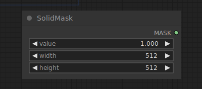

# Solid Mask

{ align=right width=450 }

The Solid Mask node can be used to create a solid masking containing a single value.

## inputs

`value`

:   The value to fill the mask with.

`width`

:   The width of the mask.

`height`

:   The height of the mask.

## outputs

`MASK`

:   The mask filled with a single value.

## example

example usage text with workflow image