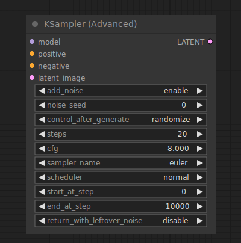

# KSampler Advanced

{ align=right width=450 }

The KSampler Advanced node is the more advanced version of the [KSampler](KSampler.md) node. While the KSampler node always adds noise to the latent followed by completely denoising the noised up latent, the KSampler Advanced node provides extra settings to control this behavior. The KSampler Advanced node can be told not to add noise into the latent with the `add_noise` setting. It can also be made to return partially denoised images via the `return_with_leftover_noise` setting. Unlike the KSampler node, this node does not have a `denoise` setting but this process is instead controlled by the `start_at_step` and `end_at_step` settings. This makes it possible to e.g. hand over a partially denoised latent to a separate KSampler Advanced node to finish the process.

!!! tip

    Given that `end_at_step >= steps` a KSampler Advanced node will denoise a latent in the exact same way a KSampler node would with a `denoise` setting of:

    `denoise = (steps - start_at_step) / steps`

## inputs

`Model`

:   The model used for denoising

`Positive`

:   The positive conditioning.

`Negative`

:   The negative conditioning.

`latent_image`

:   The latent that will be denoised.

`add_noise`

:   Wether or not to add noise to the latent before denoising. When enabled the node will inject noise appropriate for the given start step.

`seed`

:   The random seed used in creating the noise.

`control_after_generate`

:   Provides the ability to change the seed number described above after each prompt. the node can `randomize`, `increment`, `decrement` or keep the seed number `fixed`.

`steps`

:   The number of steps in the schedule. The more steps the sampler is allowed to make the more accurate the result will be. See the [samplers](samplers.md) page for good guidelines on how to pick an appropriate number of steps.

`cfg`

:   The classifier free guidance(cfg) scale determines how aggressive the sampler should be in realizing the content of the prompts in the final image. Higher scales force the image to better represent the prompt, but a scale that is set too high will negatively impact the quality of the image.

`sampler_name`

:   Which sampler to use, see the [samplers](samplers.md) page for more details on the available samplers.

`scheduler`

:   The type of schedule to use, see the [samplers](samplers.md) page for more details on the available schedules.

`start_at_step`

:   Determines at which step of the schedule to start the denoising process.

`end_at_step`

:   Determines at which step of the schedule to end denoising. When this settings exceeds `steps` the schedule ends at `steps` instead

`return_with_leftover_noise`

:   When disabled the KSampler Advanced will attempt to completely denoise the latent in the final step. Depending on how many steps in the schedule are skipped by this, the output can be inaccurate and of lower quality.

## outputs

`LATENT`

:   the denoised latent.

## example

Under construction