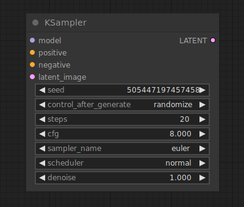

# KSampler

{ align=right width=450 }

The KSampler uses the provided model and positive and negative conditioning to generate a new version of the given latent. First the latent is noised up according to the given `seed` and `denoise` strength, erasing some of the latent image. then this noise is removed using the given `Model` and the `positive` and `negative` conditioning as guidance, "dreaming" up new details in places where the image was erased by noise.

## inputs

`Model`

:   The model used for denoising

`Positive`

:   The positive conditioning.

`Negative`

:   The negative conditioning.

`latent_image`

:   The latent that will be denoised.

`seed`

:   The random seed used in creating the noise.

`control_after_generate`

:   Provides the ability to change the seed number described above after each prompt. the node can `randomize`, `increment`, `decrement` or keep the seed number `fixed`.

`steps`

:   The number of steps to use during denoising. The more steps the sampler is allowed to make the more accurate the result will be. See the [samplers](samplers.md) page for good guidelines on how to pick an appropriate number of steps.

`cfg`

:   The classifier free guidance(cfg) scale determines how aggressive the sampler should be in realizing the content of the prompts in the final image. Higher scales force the image to better represent the prompt, but a scale that is set too high will negatively impact the quality of the image.

`sampler_name`

:   Which sampler to use, see the [samplers](samplers.md) page for more details on the available samplers.

`scheduler`

:   The type of schedule to use, see the [samplers](samplers.md) page for more details on the available schedules.

`denoise`

:   How much information of the latents should be erased by noise.

## outputs

`LATENT`

:   the denoised latent.

## example

Under construction