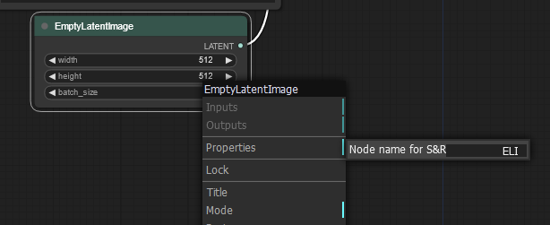

# Save File Formatting

It can be hard to keep track of all the images that you generate. To help with organizing your images you can pass specially formatted strings to an output node with a `file_prefix` widget.

## Search and replace strings

To automatically insert the values of certain node widgets into the file name the following syntax can be used: `%node_name.widget_name%` e.g. if we wish to store images on a per resolution bases we could provide the node with the following string: `%Empty Latent Image.width%x%Empty Latent Image.height%/image`. These string will then be replaced by the specified node values.

## Renaming nodes for search and replace

At times node names might be rather large or multiple nodes might share the same name. In these cases one can specify a specific name in the node option menu under `properties>Node name for S&R`

{ width=700 }

## Date time strings

ComfyUI can also inset date information with `%date:FORMAT%` where format recognizes the following specifiers:

| specifier      | description |
| -------------- | ----------- |
| `d` or `dd`    | day         |
| `M` or `MM`    | month       |
| `yy` or `yyyy` | year        |
| `h` or `hh`    | hour        |
| `m` or `mm`    | minute      |
| `s` or `ss`    | second      |

