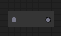
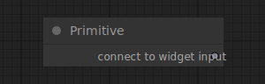

# Utility Nodes

ComfyUI comes with a set of nodes to help manage the graph.

## Reroute

{ align=right width=200 }

The Reroute node can be used to reroute links, this can be useful for organizing your workflows.

!!! tip
    the in and output on the reroute node can also be positioned vertically

## Primitive

{ align=right width=450 }

The Primitive node can be used to...