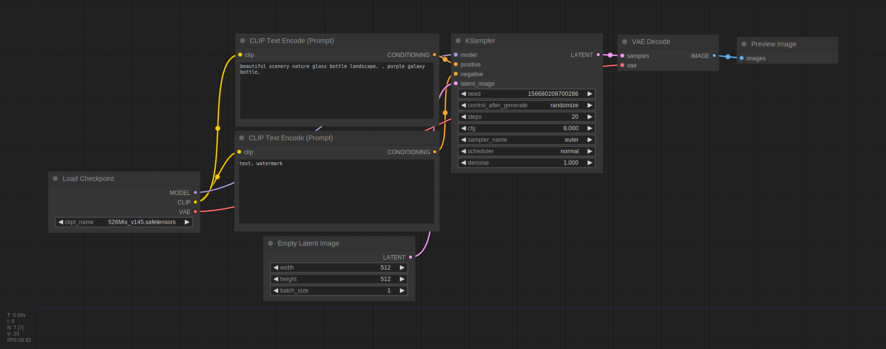

---
hide:
  - footer
---

# Welcome to the ComfyUI Community Docs!

This is the community-maintained repository of documentation related to [ComfyUI](https://github.com/comfyanonymous/ComfyUI), a powerful and modular stable diffusion GUI and backend. 

The aim of this page is to get you up and running with ComfyUI, running your first gen, and providing some suggestions for the next steps to explore.

## Installation

We won't be covering the installation of ComfyUI in detail, as the project is under active development, which tends to change the installation instructions. Instead, refer to the [README](https://github.com/comfyanonymous/ComfyUI#installing) on GitHub and find the sections that are relevant to your install (Linux, macOS or Windows).

### Downloading a Model

If you're entirely new to anything Stable Diffusion-related, the first thing you'll want to do is grab a model _checkpoint_ that you will use to generate your images. 

!!! tip "Experienced Users"

    If you already have files (model checkpoints, embeddings etc), there's no need to re-download those. You can keep them in the same location and just tell ComfyUI where to find them. To do this, locate the file called `extra_model_paths.yaml.example`, rename it to `extra_model_paths.yaml`, then edit the relevant lines and restart Comfy. Once that's done, skip to the next section.

You can find a large variety of models on websites like [CivitAI](https://civitai.com/) or [HuggingFace](https://huggingface.co/models?other=stable-diffusion). To start, grab a model _checkpoint_ that you like and place it in `models/checkpoints` (create the directory if it doesn't exist yet), then re-start ComfyUI.

## First Steps With Comfy

At this stage, you should have ComfyUI up and running in a browser tab. The default flow that's loaded is a good starting place to get familiar with. To navigate the canvas, you can either drag the canvas around, or hold ++space++ and move your mouse. You can zoom by scrolling. 

!!! tip "Accidents happen"

    If you mess something up, just hit `Load Default` in the menu to reset it to the inital state.

<figure markdown>
  { width="650" }
  <figcaption>The default startup workflow of ComfyUI (open image in a new tab for better viewing)</figcaption>
</figure>

Before we run our default workflow, let's make a small modification to preview the generated images without saving them:

1. Right-click on the `Save Image` node, then select `Remove`.
1. Double-click on an empty part of the canvas, type in `preview`, then click on the `PreviewImage` option.
1. Locate the `IMAGE` output of the `VAE Decode` node and connect it to the `images` input of the `Preview Image` node you just added.

This modification will preview your results without immediately saving them to disk. Don't worry, if you really like a particular result you can still right-click the image and choose `Save Image`

Create your first image by clicking `Queue Prompt` in the menu, or hitting ++command+enter++ or ++control+enter++ on your keyboard, and that's it!

## Loading Other Flows

To make sharing easier, many Stable Diffusion interfaces, including ComfyUI, store the details of the generation flow inside the generated PNG. Many of the workflow guides you will find related to ComfyUI will also have this metadata included. To load the associated flow of a generated image, simply load the image via the `Load` button in the menu, or drag and drop it into the ComfyUI window. This will automatically parse the details and load all the relevant nodes, including their settings.

!!! failure "No flow is displayed"

    If you load an image but no flow is displayed, it likely means that the metadata was stripped from the file. If you know the original source of the image, try asking the author to re-upload it on a site that does not strip metadata.

## Next Steps
This page should have given you a good initial overview of how to get started with Comfy. Thanks to the node-based interface, you can build workflows consisting of dozens of nodes, all doing different things, allowing for some really neat image generation pipelines. 

It's also likely that you now have a lot of questions of what just happened, what each node does, and _"how do I do X thing"_-type questions. These should hopefully be answered in the rest of these docs.

## Further support

Have additional questions that aren't answered by the manual? Check out the [ComfyUI Matrix space](https://app.element.io/#/room/%23comfyui_space%3Amatrix.org)!